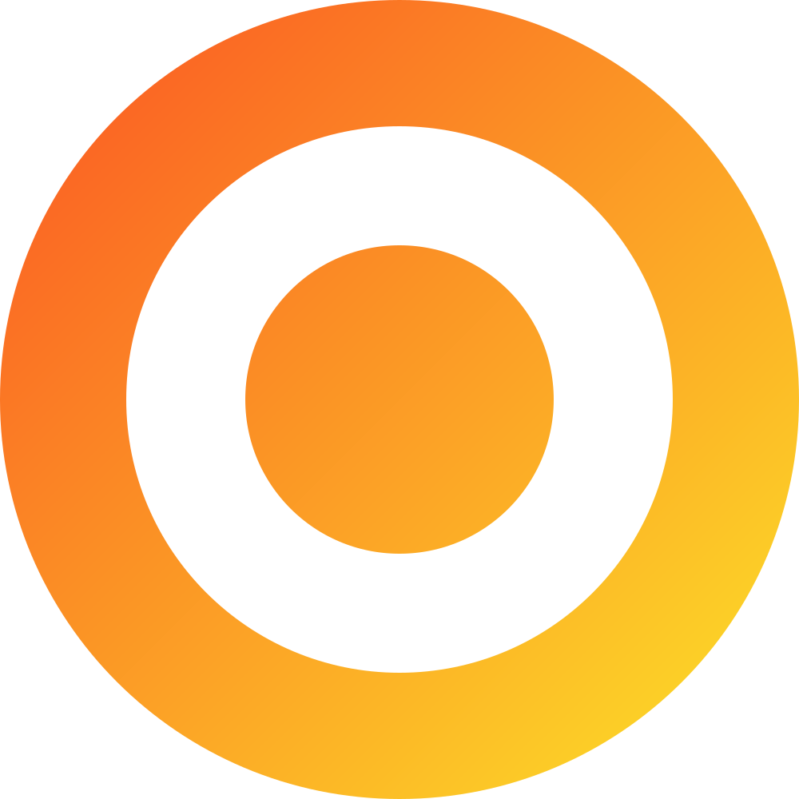

  

<h1 align="center">Onedl</h1>

---

## Background

Onedl is the open sourced code for the Fundl project.

## Code Repositories

### [Backend](https://github.com/aeriotech/onedl-gateway/)

### [App](https://github.com/aeriotech/onedl-app)

### [Admin Panel](https://github.com/aeriotech/onedl-admin)

## Tools used

    
    &nbsp;&nbsp;
    
    &nbsp;&nbsp;
    
    &nbsp;&nbsp;
    
    &nbsp;&nbsp;
    
    &nbsp;&nbsp;
    
    &nbsp;&nbsp;
    
    &nbsp;&nbsp;
    
    &nbsp;&nbsp;
    
    &nbsp;&nbsp;
    

###### Fundl is a trademark of [Marijan Musek](http://www2.uil-sipo.si/dse.htm).